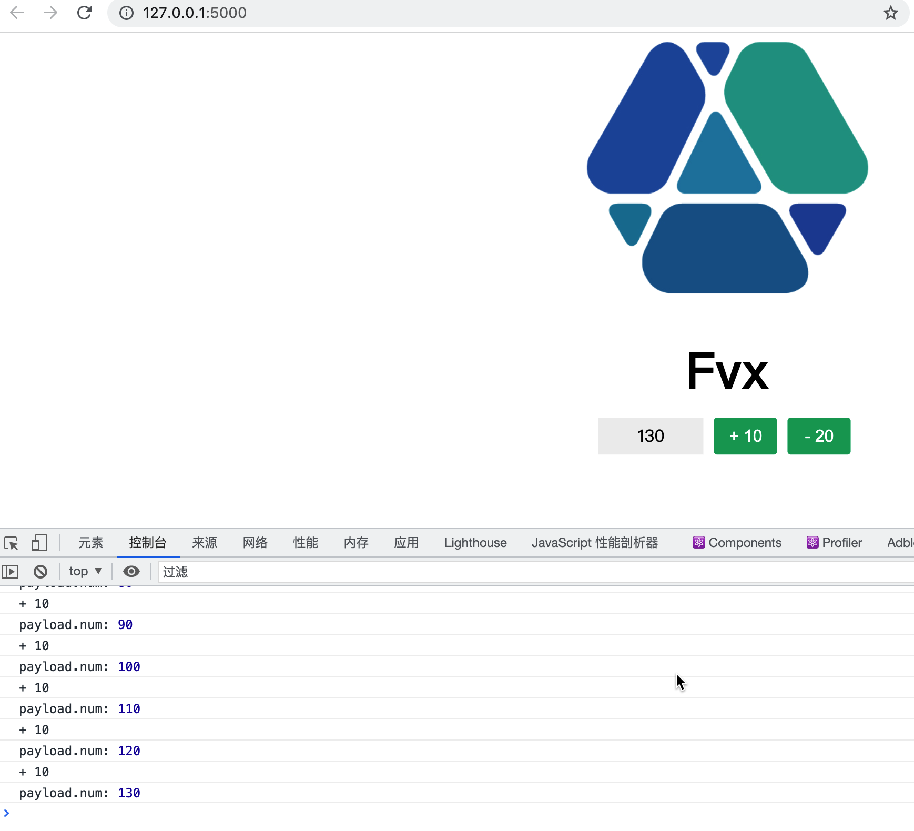

# Getting started with Flask, React, React-redux and webpack

## init && setup project 

```
python3 -m venv /Users/lihong/workbench/dev/src/github.com/researchlab/cbp/python/04-flask-react

source ./bin/activate
```

## flask setup

```
pip3 install flask
```

## 生成 requirements 

```
pip3 install pipreqs

# 在当前目录生成

pipreqs . --encoding=utf8 --force

--force 强制执行，当 生成目录下的requirements.txt存在时覆盖。

# 使用requirements
pip3 install -r requirements.txt
```

自定义favicon 路径

这里不用htmlwebpackplugin 自带的favicon 字段，因为它不能指定output.path

这里用favicons-webpack-plugin

link: https://www.npmjs.com/package/favicons-webpack-plugin

```
$ npm install --save-dev favicons favicons-webpack-plugin

plugins: [
  new FaviconsWebpackPlugin({
    // Your source logo (required)
    logo: './src/logo.png',
    // Enable caching and optionally specify the path to store cached data
    // Note: disabling caching may increase build times considerably
    cache: true,
    // Override the publicPath option usually read from webpack configuration
    publicPath: '/static',
    // The directory to output the assets relative to the webpack output dir.
    // Relative string paths are allowed here ie '../public/static'. If this
    // option is not set, `prefix` is used.
    outputPath: '/public/static',
    // Prefix path for generated assets
    prefix: 'assets/',
    // Inject html links/metadata (requires html-webpack-plugin).
    // This option accepts arguments of different types:
    //  * boolean
    //    `false`: disables injection
    //    `true`: enables injection if that is not disabled in html-webpack-plugin
    //  * function
    //    any predicate that takes an instance of html-webpack-plugin and returns either
    //    `true` or `false` to control the injection of html metadata for the html files
    //    generated by this instance.
    inject: true,

    // Favicons configuration options (see below)
    favicons: {
      ...
    }
  })
]

```




## run project 

单独运行前端 

```shell
cd 04-flask-react/web 
yarn start 
```
注意，单独运行前端， 此时如果想调用后端，需要通过nginx等服务器来转发后端请求，因为前端发起的请求是基于前端启动的端口如9901, 但是后端服务器的端口不是这个， 那么怎么让这个请求到达后端服务器？就是通过nginx rewrite 转发，如果是多个微服务记得加上转发前缀，以便于区分微服务

联合运行项目 

联合运行，就是yarn build 之后，会把编译好的静态前端文件放入python flask对应的目录下 只需要在运行flask即可， python app.py
```shell
cd 04-flask-react/web
yarn build 

cd 04-flask-react
source ./bin/activate 
cd 04-flask-react/src 
flask run 
```


### node.js 版本过高

版本过高导致 webpack有问题，根据提示需要配置如下 

```shell
// config/webpack.base.js
const Appconfig = {
   resolve:{
			fallback:{
				url:false
			}
    },
 
```
